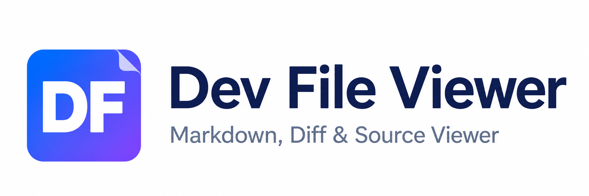
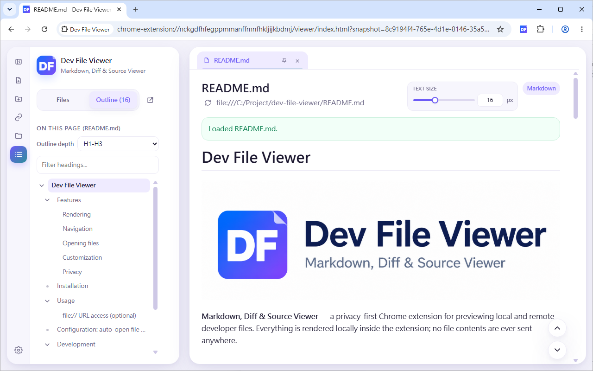
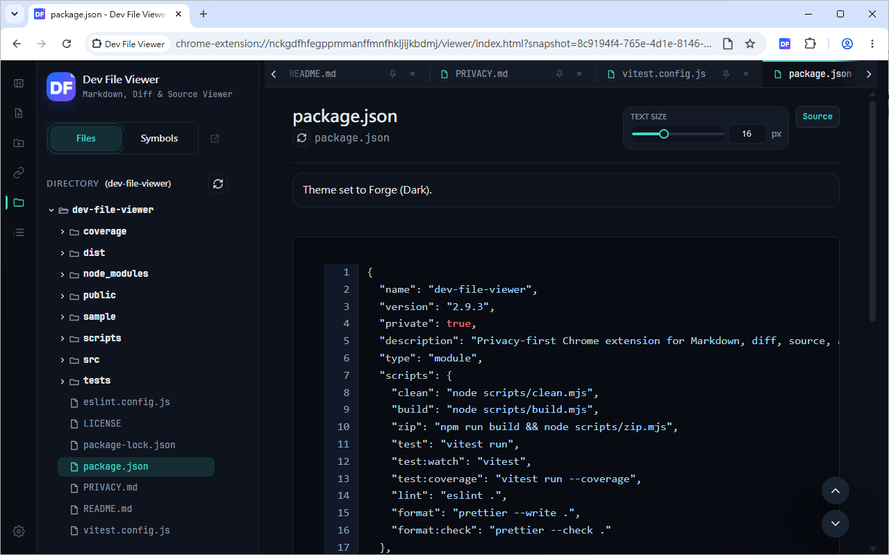
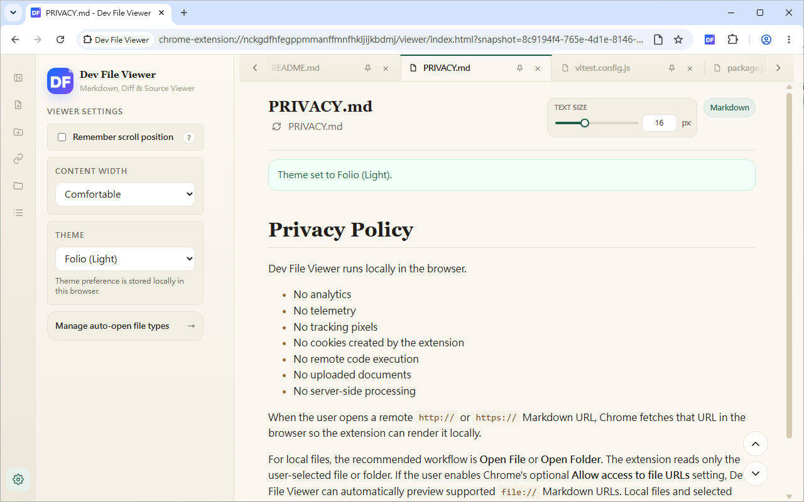
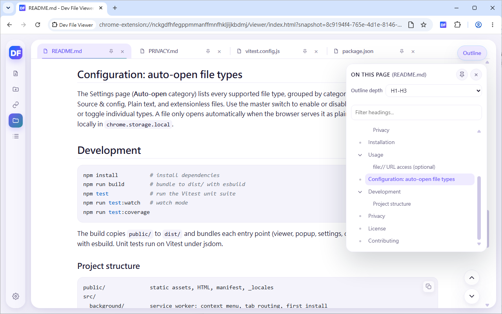
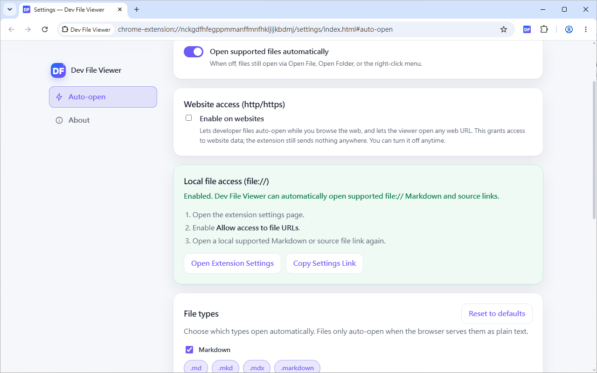

# Dev File Viewer



**Markdown, Diff & Source Viewer** — a privacy-first Chrome extension for previewing local and remote developer files. Everything is rendered locally inside the extension; no file contents are ever sent anywhere.

[Available in the Chrome Web Store](https://chromewebstore.google.com/detail/dev-file-viewer/gfjgmjflgdgdifmgfebfdcagcllglelm)

## Features

### Rendering

- **Markdown** with GitHub-flavored syntax, tables, and stable heading anchors
- **Mermaid** diagrams from ` ```mermaid ` fenced code blocks
- **Source code** viewer with syntax highlighting for dozens of languages, plus common extensionless files (`Dockerfile`, `Makefile`, `Gemfile`, `Rakefile`, …)
- **Diff / patch** viewer for `.diff` and `.patch` with unified/split view
- **Plain text** with line-ending detection

### Navigation

- **Outline / Table of Contents** generated from headings, available as a sidebar tab and a low-distraction floating popover
- Draggable, pinnable floating Outline button
- **Directory tree** sidebar for a user-selected local folder
- **Multiple file tabs** with pin and close

### Customization

- Selectable themes: System (light/dark), Bloom, Forge, and Folio
- Adjustable content width: Narrow, Comfortable, Wide, or Full
- Adjustable viewer text size
- Optional per-file scroll-position memory (current browser session only)
- Resizable and collapsible sidebar with persisted layout
- English, Traditional Chinese, and Simplified Chinese UI

### Privacy

- 100% client-side; offline-only runtime — the parser, sanitizer, renderer, and Mermaid are all bundled inside the extension
- No tracking, no analytics, no data collection

## Screenshots

### Markdown Viewer with Directory Tree (Bloom Theme)



### Source Viewer with Outline Tree (Forge Theme)



### Viewer Settings (Folio Theme)



### Draggable, pinnable floating Outline



### Extension Settings



## Installation

Requires Chrome 111 or newer.

### Install from Chrome Web Store (Recommended)

Install directly from the Chrome Web Store: [Dev File Viewer](https://chromewebstore.google.com/detail/dev-file-viewer/gfjgmjflgdgdifmgfebfdcagcllglelm)

1. Visit the Chrome Web Store link above
2. Click "Add to Chrome" button
3. Confirm the installation when prompted

### Install from a release

1. Download `dev-file-viewer-v<version>-dist.zip` from the [latest release](https://github.com/yhchiu/dev-file-viewer/releases/latest).
2. Create a new, empty folder and extract the zip into it. The archive has no top-level folder, so extracting it directly into `Downloads` would scatter the files.
3. Open `chrome://extensions`, enable **Developer mode**, click **Load unpacked**, and select that folder.

Keep the folder in place after installing — Chrome loads the extension from it on every start.

### Build from source

```bash
npm install
npm run build
```

Then open `chrome://extensions`, enable **Developer mode**, click **Load unpacked**, and select the generated `dist/` folder.

## Usage

- **Open File / Open Folder** — preview local files without changing any Chrome setting. Open Folder builds a directory tree in the sidebar.
- **Open URL** — paste a remote Markdown or source URL.
- **Automatic preview** — when you open a supported file in the browser and it is served as plain text, the full viewer opens automatically by default. Enable **Inline Preview** in Settings to render directly in the original page, keep the original `file://` or `http(s)://` URL, and allow translation, gesture, dictionary, and accessibility extensions to work with the rendered DOM. The Inline Preview toolbar includes an **Outline** popup for Markdown section navigation and a **Text size** control that shares the same 12–24 px preference as the Full Viewer. Mermaid fenced code blocks are rendered on demand through a separate lazy-loaded bundle, so ordinary Inline Preview pages do not load Mermaid.
- **Settings** — open the options page (toolbar popup → **Open Settings**, or right-click the extension → **Options**) to choose which file types open automatically and to manage `file://` access.

Once a document is open, use the activity rail to switch between the Open, Files, Outline, and Settings panels, the floating Outline button for a quick section jump, the divider to resize the sidebar (double-click to reset), and the file tabs to move between open documents.

### `file://` URL access (optional)

Automatic preview of `file://…` links is an advanced workflow that requires a Chrome permission:

1. Open the popup or the Settings page.
2. Go to **Settings → Auto-open → Local file access** and open the extension settings.
3. Enable **Allow access to file URLs**.
4. Open the local file link again.

If the settings button does not deep-link in a Chromium-based browser, use **Copy Link** and paste the copied `chrome://extensions/?id=...` URL manually.

The extension cannot enumerate local directories from a `file://` URL. The directory tree is only available after you explicitly choose a folder with **Open Folder**.

## Configuration: auto-open file types

The Settings page (**Auto-open** category) lists every supported file type, grouped by category — Markdown, Diff & patch, Source & config, Plain text, and extensionless files. Use the master switch to enable or disable automatic opening entirely, or toggle individual types. **Inline Preview is disabled by default**; turn it on to render automatic previews in the original page instead of redirecting them into the full `chrome-extension://` viewer. A file only opens automatically when the browser serves it as plain text. Preferences are stored locally in `chrome.storage.local`.

## Development

```bash
npm install          # install dependencies
npm run build        # bundle to dist/ with esbuild
npm test             # run the Vitest unit suite
npm run test:watch   # watch mode
npm run test:coverage
```

The build copies `public/` to `dist/` and bundles each entry point (viewer, popup, settings, content script, service worker) with esbuild. Unit tests run on Vitest under jsdom.

### Project structure

```text
public/              static assets, HTML, manifest, _locales
src/
  background/        service worker: context menu, tab routing, first install
  content/           auto-detect plain-text developer pages in the browser
  popup/             toolbar popup
  settings/          multi-category settings page (Auto-open, About)
  viewer/            viewer app shell and orchestration
  features/          sidebar directory tree UI
  plugins/           Mermaid and the plugin registry
  core/
    browser/         file:// access helpers
    config/          feature flags and auto-open preferences
    diff/            diff rendering and outline
    format/          file-type detection and the auto-open catalog
    highlight/       syntax highlighting
    i18n/            chrome.i18n wrapper
    markdown/        Markdown engine and code-copy buttons
    security/        sanitization and safe link policy
    source/          source-code rendering and symbols
    sources/         URL, file, and directory source providers
    toc/             heading index and anchors
    ui/              icons and shared chrome theming
```

## Privacy

See [`PRIVACY.md`](PRIVACY.md).

## License

This project is licensed under the GNU General Public License v3 (GPL v3).

Copyright (C) Yu-Hsiung Chiu

## Contributing

Contributions are welcome! Please feel free to submit issues, feature requests, or pull requests.
