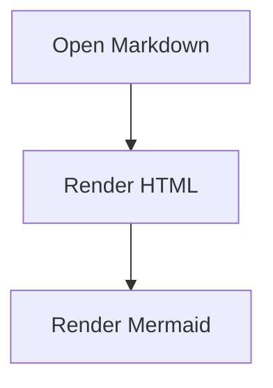

# Dev File Viewer V2.9.3


Dev File Viewer is a Chrome Extension for previewing local and remote developer-oriented files. The product subtitle is **Markdown, Diff & Source Viewer**. V2.9.3 continues the V2 roadmap with collapsible TOC / Outline heading groups. The Outline now builds a navigable H1-H3 tree with SVG disclosure controls, shared collapsed state between sidebar and floating popover, active-section auto-expansion, and filter-aware visibility while keeping the existing Markdown, Mermaid, table, link, local-folder, sidebar, content-width, scroll-memory, and `file://` preview features.

## V2.9.3 scope

- Collapsible Outline heading groups for H1-H3 headings.
- SVG chevron controls for headings with children.
- Click chevron to expand/collapse; click heading text to navigate.
- Active heading auto-expands its ancestors.
- Filter mode temporarily shows matching headings and their parent path.
- Sidebar Outline and floating TOC popover share runtime-only collapsed state.


- Markdown preview for `.md`, `.mkd`, `.mdx`, `.markdown`
- Open files from `file://`, `http://`, and `https://`
- Local file and folder picker
- Sidebar directory tree for user-selected local folders
- Sidebar collapse/expand control with persisted preference
- Resizable sidebar width with persisted local UI preference
- Adjustable Markdown content width: Narrow, Comfortable, Wide, or Full width
- HiDPI-aware popup and sidebar logos using `srcset` instead of scaling `icon48.png`
- Table of Contents / Outline tab generated from Markdown headings H1-H3
- Floating Outline button when the sidebar is collapsed, popped out, or whenever the Outline popover is pinned
- Draggable floating Outline button; the popover follows the button position during the current runtime session
- Pinnable Outline popover; the pin state is stored in `chrome.storage.local`
- Low-distraction Outline popover for quick section jumps without reopening the full sidebar
- Heading filter when a document has many headings
- Active section highlighting while reading
- Smooth section jump from the Outline tab
- Stable heading anchors for same-page Markdown links and TOC links
- Markdown table rendering
- Markdown links: external links, same-page anchors, and folder-relative links to other Markdown files
- Mermaid fenced-code blocks using ` ```mermaid `
- First-install onboarding page
- Auto-collapsed Open/Settings tools after a folder is successfully opened
- Optional scroll position memory per file, stored only in local session storage
- Popup and viewer status for Chrome's `file://` URL access setting
- One-click button to open the extension settings page
- Copyable settings URL fallback
- Offline-only runtime: all parser, sanitizer, renderer, and Mermaid code are bundled inside the extension
- 100% client-side processing
- No tracking, no analytics, no data collection

## Local-file UX recommendation

For non-technical users, use **Open File** or **Open Folder**. These workflows do not require the user to enable Chrome's advanced `file://` URL access setting.

Automatic preview for `file://.../*.md` links is an advanced workflow. Chrome requires the user to enable file URL access manually:

1. Open the Dev File Viewer popup, onboarding page, or viewer.
2. Click **Open Settings**.
3. Enable **Allow access to file URLs**.
4. Open the local Markdown URL again.

If the settings button does not deep-link correctly in a Chromium-based browser, use **Copy Link** and paste the copied `chrome://extensions/?id=...` URL manually.

The extension cannot silently enumerate local directories from a `file://` URL. The sidebar directory tree is available only after the user explicitly selects a folder with **Open Folder**.

## Install for development

```bash
npm install
npm run build
```

Then open `chrome://extensions`, enable **Developer mode**, click **Load unpacked**, and select the generated `dist/` folder.

## Usage

- Open a remote Markdown URL, then use the extension popup or context menu.
- Open a local Markdown URL after enabling file URL access. Automatic `file://` preview is routed through the background service worker to avoid Chrome blocking direct `chrome-extension://` navigation from the file page.
- Use **Open File** to read one local file without changing Chrome settings.
- Use **Open Folder** to build a directory sidebar from a selected folder. After a folder opens, the Open/Settings panel collapses automatically; expand it again when needed. Use **Files / Outline** to switch between folder navigation and the current document TOC. Use the sidebar arrow to collapse the full sidebar, the `☰` button to restore it, and the floating **Outline** button to open a quick TOC popover without reopening the sidebar. Drag the floating **Outline** button to move both the button and popover for the current runtime session. Use the popover pin button to keep the Outline button/popover visible and prevent automatic closing on outside click, Escape, section click, or sidebar expansion. Drag the divider between the sidebar and preview pane to resize the sidebar; double-click the divider to reset it. Use **Content Width** to switch the Markdown reading area between Narrow, Comfortable, Wide, and Full width.
- Enable **Remember scroll position** after opening a folder if you want each file to reopen at its last scroll position during the current browser session. When disabled, files open at the first line.
- Markdown links are supported. External links open in a new tab. Folder-relative links to Markdown files open inside Dev File Viewer.
- Markdown tables are rendered from pipe table syntax:

```markdown
| Feature | Status |
|---|---:|
| Markdown | Supported |
| Mermaid | Supported |
| Tables | Supported |
```

- Mermaid diagrams are rendered from fenced code blocks:

````markdown

````


## V2.9.3 notes

- Refined **TOC Phase 2** with SVG-based pop-out and pin controls instead of emoji glyphs.
- Dragging the floating **Outline** button moves both the button and the TOC popover. This position is runtime-only and is not stored in `chrome.storage.local`.
- The floating Outline button now defaults to the viewer pane's top-left area. When the sidebar is open, placement is clamped to the viewer pane so it does not cover the sidebar.
- Added a pin switch in the TOC popover header. The pin state is stored in `chrome.storage.local`.
- When pinned, the floating Outline button and TOC popover remain available even after reopening the sidebar.
- When pinned, the TOC popover no longer auto-closes on outside click, Escape, or section selection.
- Heading filtering still appears when the document has 12 or more headings and is shared between the sidebar Outline and the popover Outline.

## V2.0.1 notes

- Added **Outline** as TOC Phase 1. It is generated from rendered Markdown headings, so code blocks containing `#` are ignored.
- The sidebar has **Files** and **Outline** tabs. Tab switching is runtime-only and is not saved to `chrome.storage.local`. Files shows the selected folder tree; Outline shows the current document section list.
- Outline currently indexes H1-H3 headings by default to keep navigation useful without becoming noisy. The title shows the current file name, for example `On this page (03-bridge.md)`.
- Clicking an Outline item smoothly scrolls the internal viewer pane to the heading and updates the viewer URL hash. Opening a single Markdown file with headings automatically switches to Outline and collapses Open/Settings to maximize reading space.
- Scrolling the document highlights the active heading in the Outline tab.
- Heading IDs are generated when missing, with duplicate handling, so same-page anchor links and TOC links share the same target IDs.

## V1.1.7 notes

- Replaced the Chrome extension icon set with the new blue-to-purple **DF** app icon.
- Updated the in-app brand mark used in the popup, onboarding page, and viewer sidebar to match the new icon style.
- Added brand assets under `public/assets/brand/`, including the horizontal brand-mark lockup and high-resolution icon source.

- Added a **Content Width** setting for the Markdown reading area. Choices are Narrow, Comfortable, Wide, and Full width. The preference is stored in `chrome.storage.local`.
- Added a draggable sidebar divider so users can resize the directory sidebar. The width is stored as a local UI preference and can be reset by double-clicking the divider.
- Added a sidebar collapse/expand control. The collapsed state is stored as a local UI preference so the viewer keeps the same layout after reopening.
- Fixed a viewer layout issue where long Markdown documents with Mermaid diagrams or wide tables could show both the page scrollbar and the viewer scrollbar. The app shell now owns the viewport height and only the sidebar/viewer panes scroll internally.
- Earlier V1.1 builds redirected a detected Markdown page directly from the content script with `location.replace(chrome-extension://...)`. Chrome can block that page-initiated navigation and show `ERR_BLOCKED_BY_CLIENT`. The current build captures the already-loaded Markdown text, stores it temporarily in `chrome.storage.session`, and asks the background service worker to replace the tab with the viewer using `chrome.tabs.update()`.
- Folder mode now collapses the Open/Settings tools after successful folder selection.
- Folder mode includes optional per-file scroll position memory using session-only local storage.
- Markdown links now support external links, anchors, and relative links between Markdown files in the selected folder.

## Architecture for V2 expansion

```text
src/
  core/
    browser/           browser-specific helpers, such as file URL access UX
    format/            file-type detection and format registry
    markdown/          Markdown engine boundary
    toc/               heading anchors and Table of Contents index
    security/          sanitization and safe link policies
    sources/           URL, file, and directory source providers
  features/sidebar/    local directory tree UI
  plugins/             syntax/plugin lifecycle
  viewer/              app shell and orchestration
  onboarding/          first-run and permission guidance
  content/             auto-detect Markdown URL pages
  background/          context menu and tab actions
```

V2 should add new format renderers without changing the viewer shell:

- `FormatRegistry`: add `diff`, `source-code`, `log`, etc.
- `RendererRegistry`: map a format to a renderer implementation.
- `PluginRegistry`: add Markdown plugins such as emoji, math, alerts, checkboxes. TOC Phase 1 currently lives in the viewer/core TOC boundary so it can later become a full Markdown plugin.
- `ThemeService`: switch CSS variables for light/dark themes.
- `CommandRegistry`: centralize keyboard shortcuts and command palette actions.

## Privacy

See `PRIVACY.md`.


## V2.9.3 fix

- Fix source code viewer crash: initialize `SourceCodeRenderer` before rendering source files.
