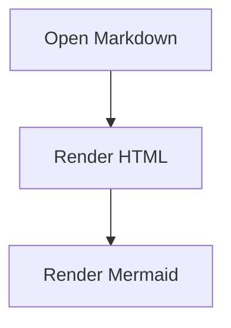

# Dev File Viewer V1

Dev File Viewer is a Chrome Extension for previewing local and remote developer-oriented files. V1 focuses on Markdown and Mermaid while keeping the internal architecture ready for V2 formats such as diff files, source code, syntax highlighting, GFM, alerts, themes, and keyboard shortcuts.

## V1 scope

- Markdown preview for `.md`, `.mkd`, `.mdx`, `.markdown`
- Open files from `file://`, `http://`, and `https://`
- Local file and folder picker
- Sidebar directory tree for user-selected local folders
- Mermaid fenced-code blocks using ` ```mermaid `
- Offline-only runtime: all parser, sanitizer, renderer, and Mermaid code are bundled inside the extension
- 100% client-side processing
- No tracking, no analytics, no data collection

## Important Chrome behavior

For `file://` URLs, Chrome requires the user to enable file URL access manually:

1. Open `chrome://extensions`
2. Find **Dev File Viewer**
3. Enable **Allow access to file URLs**

The extension cannot silently enumerate local directories from a `file://` URL. The sidebar directory tree is available after the user explicitly selects a folder with **Open Folder**.

## Install for development

```bash
npm install
npm run build
```

Then open `chrome://extensions`, enable **Developer mode**, click **Load unpacked**, and select the generated `dist/` folder.

## Usage

- Open a remote Markdown URL, then use the extension popup or context menu.
- Open a local Markdown URL after enabling file URL access.
- Use **Open File** to read one local file.
- Use **Open Folder** to build a directory sidebar from a selected folder.
- Mermaid diagrams are rendered from fenced code blocks:

````markdown

````

## Architecture for V2 expansion

```text
src/
  core/
    format/            file-type detection and format registry
    markdown/          Markdown engine boundary
    security/          sanitization and safe link policies
    sources/           URL, file, and directory source providers
  features/sidebar/    local directory tree UI
  plugins/             syntax/plugin lifecycle
  viewer/              app shell and orchestration
  content/             auto-detect Markdown URL pages
  background/          context menu and tab actions
```

V2 should add new format renderers without changing the viewer shell:

- `FormatRegistry`: add `diff`, `source-code`, `log`, etc.
- `RendererRegistry`: map a format to a renderer implementation.
- `PluginRegistry`: add Markdown plugins such as emoji, math, TOC, alerts, checkboxes.
- `ThemeService`: switch CSS variables for light/dark themes.
- `CommandRegistry`: centralize keyboard shortcuts and command palette actions.

## Privacy

See `PRIVACY.md`.
