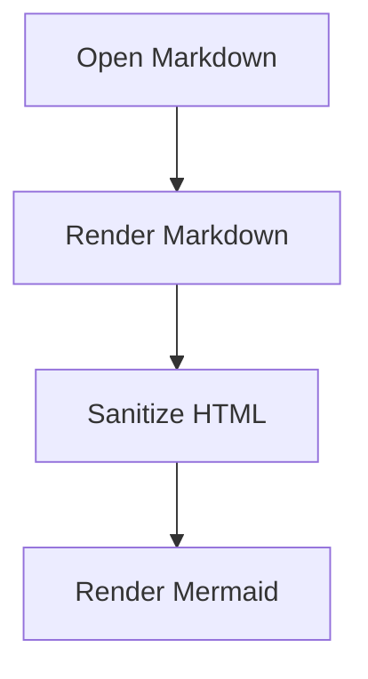

# Dev File Viewer Sample

This is a local Markdown sample for V1.

## Mermaid



## Code

```js
console.log('Future V2 will add syntax highlighting.');
```

## Links

- [Chrome Extensions docs](https://developer.chrome.com/docs/extensions/)
- [Relative sample](./example.md)
