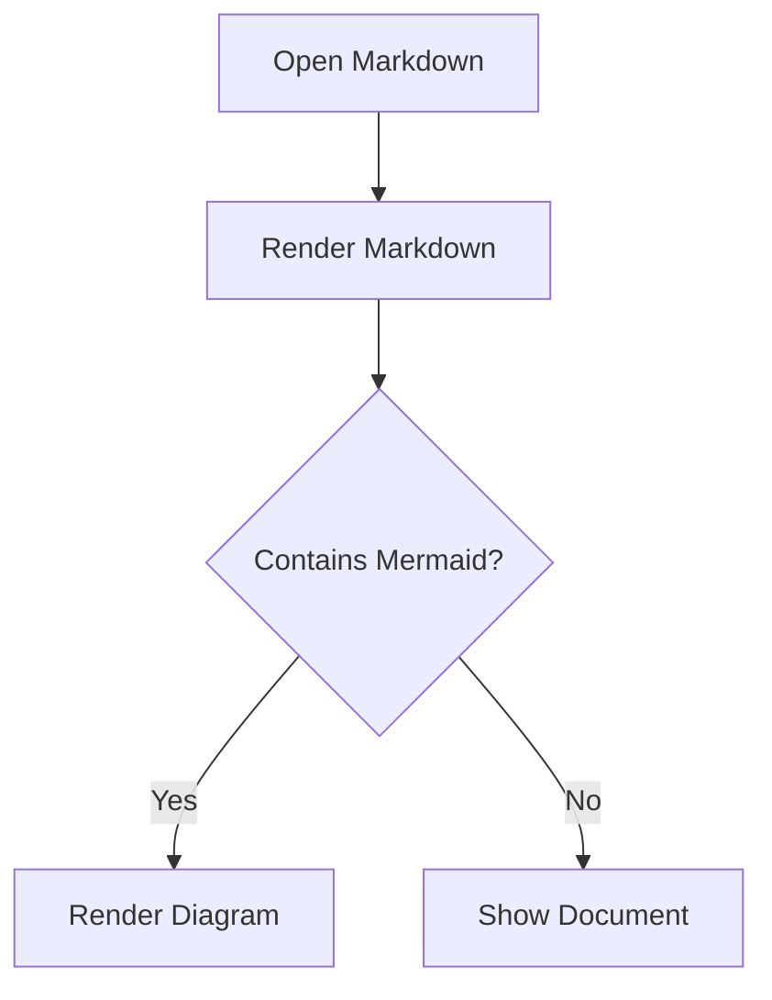

# Dev File Viewer Sample

This sample verifies Markdown rendering, tables, Mermaid diagrams, and links.

## Table Rendering

| Feature | Status | Notes |
|---|---:|---|
| Markdown | ✅ | `.md`, `.mkd`, `.mdx`, `.markdown` |
| Tables | ✅ | GitHub-style pipe tables |
| Mermaid | ✅ | Client-side only |
| Links | ✅ | External, anchors, and folder-relative Markdown links |

## Link Rendering

- [Jump to Mermaid section](#mermaid-diagram)
- [Open an external site](https://example.com/)
- [Open another Markdown file in the same opened folder](linked.md)
- [Open a nested Markdown file](docs/notes.md)

## Mermaid Diagram



## Code Block

```js
const message = 'Dev File Viewer';
console.log(message);
```
