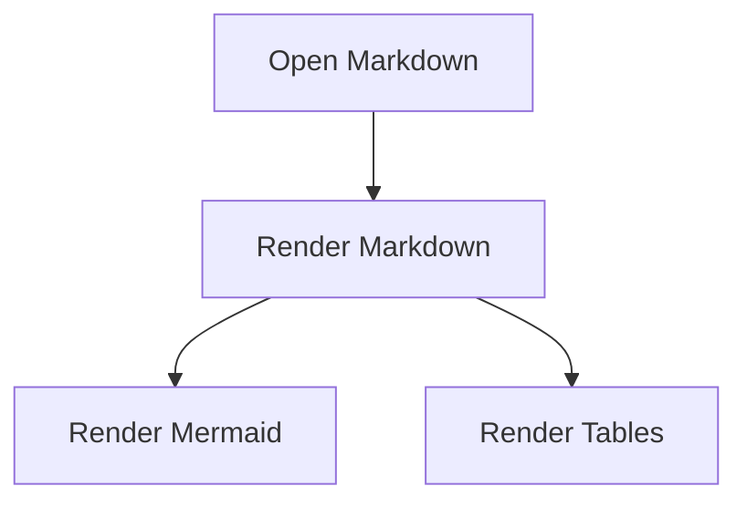

# Dev File Viewer V1.1.1 Sample

This sample verifies Markdown rendering, Mermaid diagrams, and Markdown tables.

## Table rendering

| Feature | Status | Notes |
|---|---:|---|
| Markdown files | ✅ | `.md`, `.mkd`, `.mdx`, `.markdown` |
| Mermaid diagrams | ✅ | Rendered after Markdown sanitization |
| Tables | ✅ | Enabled |
| Diff viewer | Planned | Reserved for V2 |
| Source-code viewer | Planned | Reserved for V2 |

## Mermaid rendering

## Local files

For non-technical users, prefer **Open File** or **Open Folder**.

Automatic `file://` URL preview is optional and requires enabling **Allow access to file URLs** in Chrome's extension settings.
